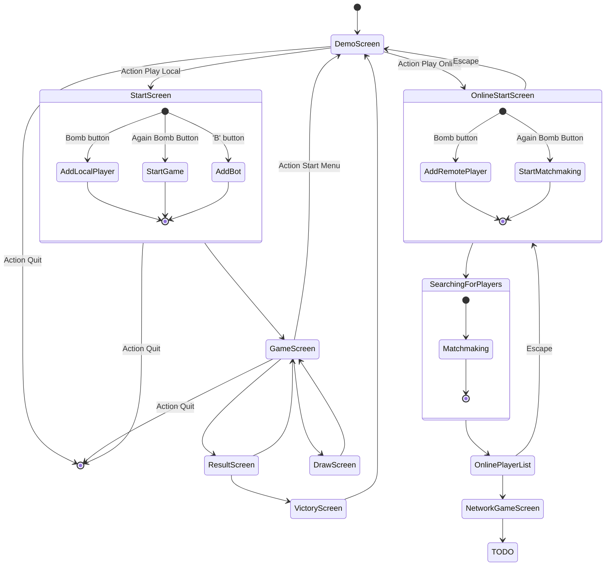

# Network game specification

## Start game
type: 00

TODO:

## Send player data

```cs
// Binary protocol in C# interface

interface GameData
{
    byte type = 1;
    // byte PlayersCount;
    PlayerData[] Players;
}

interface PlayerData
{
    byte XPart1;
    byte XPart2;
    byte YPart1;
    byte YPart2;
    byte Direction; // 4 = null
    byte BombsCount;
    Bomb[] Bombs;
}

interface BombData
{
    byte X;
    byte Y;
    byte EstimateTime;
    byte MaxFire;
}
```

## Ping Request

```cs
interface PingRequest
{
    byte Type = 2;
}
```

## Ping Response
```cs
interface PingResponse
{
    byte Type = 2;
}
```

## Start dialogs

