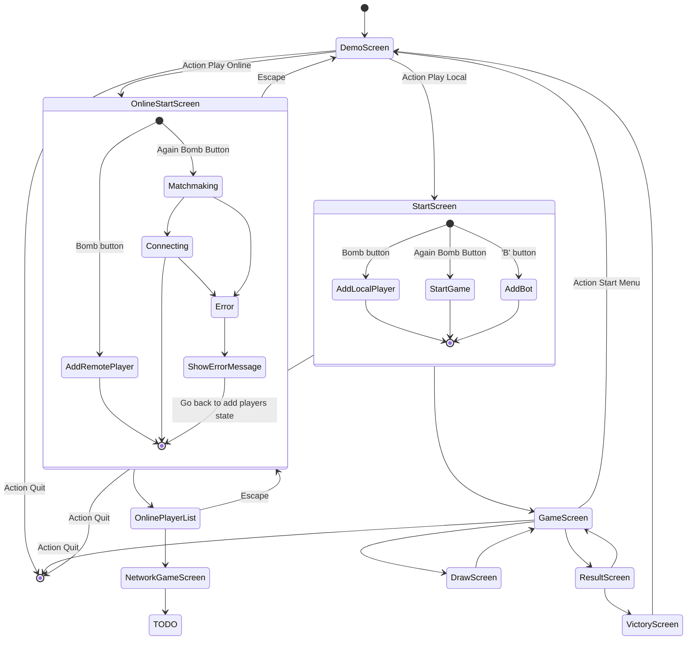

```mermaid
stateDiagram-v2
    [*] --> DemoScreen
    DemoScreen --> OnlineStartScreen : Action Play Online
    DemoScreen --> StartScreen : Action Play Local
    DemoScreen --> [*] : Action Quit

    state OnlineStartScreen {
        [*] --> AddRemotePlayer : Bomb button
        AddRemotePlayer --> [*]
        [*] --> Matchmaking : Again Bomb Button
        Matchmaking --> Connecting
        Connecting --> [*]
        Matchmaking --> Error
        Connecting --> Error
        Error --> ShowErrorMessage
        ShowErrorMessage --> [*] : Go back to add players state
    }

    state StartScreen {
        [*] --> AddLocalPlayer : Bomb button
        AddLocalPlayer --> [*]
        [*] -->  StartGame: Again Bomb Button
        StartGame --> [*]
        [*] --> AddBot: 'B' button
        AddBot --> [*]
    }

    OnlineStartScreen --> OnlinePlayerList
    StartScreen --> GameScreen
    StartScreen --> [*]: Action Quit
    GameScreen --> ResultScreen
    GameScreen --> DrawScreen
    GameScreen --> DemoScreen: Action Start Menu
    GameScreen --> [*]: Action Quit
    ResultScreen --> VictoryScreen
    ResultScreen --> GameScreen
    VictoryScreen --> DemoScreen
    DrawScreen --> GameScreen

    OnlinePlayerList --> NetworkGameScreen
    OnlinePlayerList --> OnlineStartScreen: Escape
    OnlineStartScreen --> DemoScreen: Escape
    NetworkGameScreen --> TODO
```
